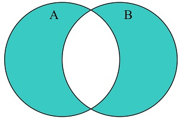
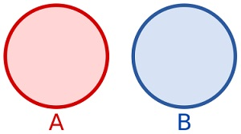

# Basic Concepts of JS

# Table of contents

- [Basic Concepts of JS](#basic-concepts-of-js)
- [Table of contents](#table-of-contents)
- [JS cheat sheet](#js-cheat-sheet)
  - [1. Hoisting](#1-hoisting)
  - [2. Strict equality and loose equality operator](#2-strict-equality-and-loose-equality-operator)
  - [3. Data Type in Javascript](#3-data-type-in-javascript)
    - [3.1. String](#31-string)
    - [3.2. Number](#32-number)
    - [3.3. BigInt](#33-bigint)
    - [3.4. Boolean](#34-boolean)
    - [3.5. Undefined](#35-undefined)
    - [3.6. Null (Empty)](#36-null-empty)
    - [3.7. Symbol (Unique value)](#37-symbol-unique-value)
    - [3.8. Object](#38-object)
      - [3.8.1. Add, modify, delete new key-value](#381-add-modify-delete-new-key-value)
      - [3.8.2. Traverse Object](#382-traverse-object)
      - [3.8.3. Check property](#383-check-property)
      - [3.8.4. Clone and merge object](#384-clone-and-merge-object)
      - [3.8.5. Destructuring](#385-destructuring)
      - [3.8.6. Method in object](#386-method-in-object)
      - [3.8.7. Object vs Map vs Set](#387-object-vs-map-vs-set)
    - [3.9. Array](#39-array)
      - [3.9.1. Add / Remove elements](#391-add--remove-elements)
      - [3.9.2. Traverse](#392-traverse)
      - [3.9.3. Search](#393-search)
      - [3.9.4. Array transformation](#394-array-transformation)
      - [3.9.5. Sort and reverse](#395-sort-and-reverse)
      - [3.9.6. Other methods](#396-other-methods)
    - [3.10. Function](#310-function)
    - [3.11. Set](#311-set)
      - [3.11.1. Basic Set methods](#3111-basic-set-methods)
      - [3.11.2. Set logic methods](#3112-set-logic-methods)
    - [3.12. Map](#312-map)
    - [3.13. Primitive and reference types](#313-primitive-and-reference-types)
  - [4. Loop](#4-loop)

# JS cheat sheet
## 1. Hoisting

- Bring the declaration up to the first scope

- So when you write like this

```javascript
console.log(greeting);
var greeting; // greeting now is undefined
```

it means

```javascript
var greeting;
console.log(greeting);
```

- But initialization is different than declaration, so when you this:

```javascript
console.log(greeting);
var greeting = "Hello!";
```

=> it is still undefined

- `let, const` are still have hoisting, but it is brought to TDZ (Temporal dead zone). So it reduce the hoisting to happen. It is more recommended way to code to prevent undefined behavior.

## 2. Strict equality and loose equality operator

- In javascript, `===` represents the strict equality operator
- Compare between two operands, check for both value equality and type equality.

```javascript
let x = 5; // int
let y = 5; // int
console.log(x === y); // true (same value and same data type)
```

- `==` represents the loose equality operator
- Perform type coercion (attempting to convert operands to a common type before comparison).

```javascript
console.log(5 == "5"); // true
```

Complete examples:

```javascript
// Strict equality (===)
console.log(5 === 5); // true (same value and same type - number)
console.log("hello" === "hello"); // true (same value and same type - string)
console.log(5 === "5"); // false (different types - number vs string)
console.log(true === 1); // false (different types - boolean vs number)
console.log(null === undefined); // false (different types - null vs undefined)

// Loose equality (==) for comparison
console.log(5 == "5"); // true (type coercion occurs, "5" becomes a number)
console.log(true == 1); // true (type coercion occurs, 1 becomes true)
console.log(null == undefined); // true (special case for loose equality)
```

## 3. Data Type in Javascript

`typeof` to check the data type of variable.

### 3.1. String

```javascript
let username = "Steven";
console.log(typeof username); // string
```

### 3.2. Number

```javascript
let birthYear = 1990;
let currYear = 2025;
let age = currYear - birthYear;
console.log(typeof age); // number
```

### 3.3. BigInt

The value of variables are out of limitation of Number (`2^53 - 1`, ~ `9007199254740991`)

```javascript
let largeNumber = BigInt("9007199254740991");
let bigNumber = 9007199254740991;
console.log(typeof largeNumber); // bigint
console.log(typeof bigNumber); // bigint
```

### 3.4. Boolean

```javascript
let isLoggedIn = true;
console.log(typeof isLoggedIn); // boolean
```

### 3.5. Undefined

```javascript
// 1. Not initialized
let userLocation;
console.log(typeof userLocation); // undefined;

// 2. A function that doesn't return the value
function sum(a, b) {
  let result = a + b; // no return statement
}
let result = sum(3, 5);
console.log(result); // undefined

// 3. Arguments which don't pass to function
function greet(name) {
  return "Hello " + name;
}
console.log(greet()); // Hello undefined

// 4. Accessing a attribute which doesn't exist
let a = [1, 2, 3];
console.log(a[5]); // undefined
```

### 3.6. Null (Empty)

Mark the variable that doesn't have absolute value or isn't found

```javascript
let searchResult = null;
console.log(typeof searchResult); // object
```

### 3.7. Symbol (Unique value)

```javascript
let uniqueID = symbol("id");
console.log(typeof uniqueID); // symbol
```

### 3.8. Object

Format: `key - value`

```javascript
    // 1. Object literal
    let user = {
        name: "Steven";
        age: 30;
    };

    // 2. Constructor function:
    function Person(name, age) {
        this.name = name;
        this.age = age;
    }
    let p = new Person("Steven", 30);

    // 3. ES6 class
    class Person {
        constructor(name, age) {
            this.name = name;
            this.age = age;
        }
    }
    let p = new Person("Steven", 30);

    // 4. Object.create() (create with specific and particular prototype)
    let proto = {
        greet: function() {
            console.log("Hi!");
        }
    };
    let obj = Object.create(proto);
    obj.greet();
```

#### 3.8.1. Add, modify, delete new key-value

```javascript
let person = {
  name: "Alice",
};
person.age = 21; // new attribute
person.name = "Steven"; // modify attribute
delete person.age; // delete attribute
console.log(person); // { name: "Steven" }
```

#### 3.8.2. Traverse Object

```javascript
let person = {
  name: "Alice",
  age: 21,
};

for (let key in person) {
  // for ... in
  console.log(key, person[key]);
}

// Object.keys (array of keys)
console.log(Object.keys(person)); // ["name","age"]

// Object.values (array of values)
console.log(Object.values(person)); // ["Alice",21];

// Object.entries (array of [key,value])
console.log(Object.entries(person)); // [["name","Alice"],["age",21]]

for (let [k, v] of Object.entries(person)) {
  console.log(`${k} = ${v}`);
}
```

#### 3.8.3. Check property

```javascript
let person = {
  name: "Alice",
};
console.log("name" in person); // true
console.log(person.hasOwnProperty("name")); // true
console.log(person.hasOwnProperty("age")); // false
```

#### 3.8.4. Clone and merge object

```javascript
let obj1 = {
  a: 1,
  b: 2,
};
let obj2 = {
  b: 3,
  c: 4,
};

// spread operator
let clone = {
  ...obj1,
};
console.log(clone); // { a:1, b:2 }

// merge
let merged = {
  ...obj1,
  ...obj2,
};
console.log(merged); // { a:1, b:3, c:4 }

// Object.assign
let merged2 = Object.assign({}, obj1, obj2);
console.log(merged2); // { a:1, b:3, c:4 }
```

#### 3.8.5. Destructuring

```javascript
let person = {
  name: "Alice",
  age: 21,
};

// quick assignment
let { name, age } = person;
console.log(name); // "Alice"

// Rename variables
let { name: fullname } = person;
console.log(fullname); // "Alice"

// default value
let { city = "Hanoi" } = person;
console.log(city); // "Hanoi"
```

#### 3.8.6. Method in object

```javascript
let animal = {
  eat() {
    console.log("Eating...");
  },
};

let dog = Object.create(animal); // dog inherits from animal
dog.bark = function () {
  console.log("Woof!");
};
dog.eat(); // "Eating..." (inherited)
dog.bark(); // "Woof!"
```

#### 3.8.7. Object vs Map vs Set

- **Object**
  - Key must be a string or symbol.
  - Great for structured data and defining entities.

```javascript
let user = { name: "Alice", age: 21 };
```

- **Map**
  - Key can be any type (string, number, object, function, …).
  - Maintains insertion order.
  - More efficient for frequent additions/deletions.

```javascript
let map = new Map();
map.set("name", "Alice");
map.set(1, "one");
map.set({ id: 1 }, "object key");
console.log(map.get("name")); // "Alice"
console.log(map.size); // 3
```

- **Set**
  - Collection of unique values.
  - No duplicates allowed.

```javascript
let set = new Set([1, 2, 2, 3]);
console.log(set); // Set { 1, 2, 3 }
set.add(4);
set.delete(2);
console.log(set.has(3)); // true
```

### 3.9. Array

```javascript
// empty array
let a = [];

// array with values
let products = ["Iphone", "Samsung Galaxy", "Google Pixel"];
console.log(typeof products); // object

// using constructor to create array
let arr = new Array(1, 2, 3);
let empty = new Array(5); // empty array with length = 5

// static methods
// 1. from() (creates a new, shallow-copied array)
Array.from(items); // iterable or array-like object to convert to an array
Array.from(items, mapFn); // mapFn: function to call on every element of the array
Array.from(items, mapFn, thisArg); // thisArg: Value to use as this when executing mapFn.
```

#### 3.9.1. Add / Remove elements

```js
let fruits = ["apple", "banana"];

// push
fruits.push("orange");
console.log(fruits); // ["apple", "banana", "orange"]

// pop
fruits.pop();
console.log(fruits); // ["apple", "banana"]

// unshift
fruits.unshift("mango");
console.log(fruits); // ["mango", "apple", "banana"]

// shift
fruits.shift();
console.log(fruits); // ["apple", "banana"]

// splice
fruits.splice(1, 0, "kiwi");
console.log(fruits); // ["apple", "kiwi", "banana"]
```

#### 3.9.2. Traverse

```js
let nums = [1, 2, 3, 4];

// traditional traversal
for (let i = 0; i < nums.length; i++) {
  // manipulation
}

// forEach with lamda function (like StreamAPI in Java)
nums.forEach((n) => console.log(n));

// map with lamda function (like StreamAPI in Java)
let doubled = nums.map((n) => n * 2);
console.log(doubled); // [2,4,6,8]

// filter with lamda function (like StreamAPI in Java)
let evens = nums.filter((n) => n % 2 === 0);
console.log(evens); // [2,4]
```

#### 3.9.3. Search

```js
let arr = [10, 20, 30, 40];

// includes
console.log(arr.includes(20)); // true

// indexOf / lastIndexOf
console.log(arr.indexOf(30)); // 2
console.log(arr.lastIndexOf(30)); // 2

// find
console.log(arr.find((n) => n > 25)); // 30

// findIndex
console.log(arr.findIndex((n) => n > 25)); // 2
```

#### 3.9.4. Array transformation

```js
let nums = [1, 2, 3, 4, 5];

// slice
console.log(nums.slice(1, 4)); // [2,3,4]

// concat (concatenate)
console.log(nums.concat([6, 7])); // [1,2,3,4,5,6,7]

// join: concatenate to string
console.log(nums.join("-")); // "1-2-3-4-5"

// flat: làm phẳng mảng
let nested = [1, [2, [3, 4]]];
console.log(nested.flat(2)); // [1,2,3,4]
```

#### 3.9.5. Sort and reverse

```js
let arr = [3, 1, 4, 2];

// sort
console.log(arr.sort()); // [1,2,3,4]

// sort with compare function
console.log(arr.sort((a, b) => b - a)); // [4,3,2,1]

// reverse
console.log(arr.reverse()); // [1,4,2,3]
```

#### 3.9.6. Other methods

```js
let arr = [1, 2, 3, 4];

// some: at least one element satisfies
console.log(arr.some((n) => n > 3)); // true

// every: all elements satisfies
console.log(arr.every((n) => n > 0)); // true

// fill: assign value
console.log(arr.fill(0, 1, 3)); // [1,0,0,4]

// entries: traverse pair [index, value]
for (let [i, v] of arr.entries()) {
  console.log(i, v);
}
```

### 3.10. Function

```javascript
function calculateTax(price) {
  const taxRate = 0.1;
  return price * (1 + taxRate);
}
console.log(typeof calculateTax); // function
```

### 3.11. Set

#### 3.11.1. Basic Set methods

```javascript
// Basic Set Methods
let s = new Set();
s.add();
s.clear();
s.delete();
s.entries();
s.forEach(); // invokes a callback
s.has(); // search element
s.keys(); // returns an Iterator object with the values
s.values(); // returns an Iterator object with the values
/* A Set has no keys, so keys() returns the same as values() */

// Set Properties
size;
```

#### 3.11.2. Set logic methods

```javascript
// in js 2025, 7 new logical methods were added to manipulate with two sets
s.union();
s.difference();
s.intersection();
s.isDisjointFrom();
s.isSubsetOf();
s.isSupersetOf();
s.symmetricDifference();
```

`union`


---

`intersection`


---

`difference`


---

`symmetricDifference`



---

`isSubsetOf`


---

`isSupersetOf`


---

`isDisjointFrom`



### 3.12. Map

```javascript
// create a map
const fruits = new Map([
  ["apples", 500],
  ["banana", 300],
  ["oranges", 200],
]);

// Common methods
m.get();
m.set();
m.delete();
m.clear();
m.has();
m.forEach();
m.entries();
m.keys();
m.values();
// properties
m.size;

// Being able to use objects as keys in an important Map feature.
// Create Objects
const apples = { name: "Apples" };
const bananas = { name: "Bananas" };
const oranges = { name: "Oranges" };

// Create a Map
const fruits = new Map();

// Add new Elements to the Map
fruits.set(apples, 500);
fruits.set(bananas, 300);
fruits.set(oranges, 200);
```

### 3.13. Primitive and reference types

**Primitive types:**

- `string`, `number`, `boolean`, `null`, `undefined`, `symbol`, `bigint`.
- Directly store in stack.
- When assigning -> create a unique copy.

```typescript
let a = 10;
let b = a;
b = 20;
console.log(a); // 10 (not influenced)
console.log(b); // 20
```

**Reference types**:

- `object`, `array`, `function`, `Date`, `Map`, `Set`, ...

## 4. Loop

```javascript
// 1. traditional for loop
for (let i = start; i < end; i++) {
  // code
}

// 2. traditional while loop
while (condition) {
  // code
}

// 3. tradition do-while loop
do {
  // code
} while (condition);

// 4. Loop with collections (Array, Object, String, ...)
// 4.1. for ... in (traverse through keys or attributes of Object or array)
let person = {
  name: "Steven",
  age: 20,
  country: "VN",
};
for (let key in person) {
  console.log(key, ":", person[key]);
}

// 4.2. for ... of (traverse through values of iterable objects of array, string, map, set, ...)
let numbers = [10, 20, 30];
for (let num of numbers) {
  console.log(num);
}

// 5. Loop by supported function and lamda (Array methods)
// 5.1. forEach()
let a = ["a", "b", "c"];
a.forEach((value, index) => {
  console.log(index, value);
});

// 5.2. map() (create new array from old array after transforming)
let nums = [1, 2, 3];
let squared = nums.map((x) => x * x);
console.log(squared); // [1, 4, 9]

// 5.3. filter() (return new array containing satisfied elements)
let nums = [1, 2, 3, 4, 5];
let evens = nums.filter((x) => x % 2 === 0);
console.log(evens); // [2, 4]

// 5.4. reduce() (Used to calculate accumulation (sum, multiply, multiply...)
let nums = [1, 2, 3, 4];
let sum = nums.reduce((acc, val) => acc + val, 0);
console.log(sum); // 10

// 6. Special loop
// for await ... of (ES2018+) (async iterable)
async function* asyncGenerator() {
  yield "Hello";
  yield "World";
}
(async () => {
  for await (let word of asyncGenerator()) {
    console.log(word);
  }
})();
```